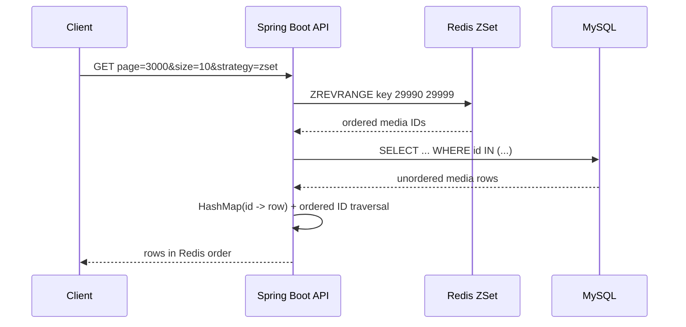

# Media Deep Pagination Demo

一个可运行的 Spring Boot 学习项目，用来对比 MySQL `LIMIT offset, size` 与 Redis ZSet 有界深分页，并完整展示 ID 索引、详情批查、Java 重排、安全重建、写后维护和故障降级。

> 本仓库是通用学习/面试演示实现，不是任何公司的内部代码、架构或生产数据；仓库不承诺固定性能提升比例。

## 要解决的问题

假设媒体按 `publish_time DESC, id DESC` 排序，请求第 3000 页、每页 10 条：

```text
offset = (3000 - 1) * 10 = 29990
Redis rank = 29990..29999
```

MySQL 即使命中联合索引，`LIMIT 29990, 10` 仍需要沿索引扫描并丢弃前 29,990 条记录。ZSet 方案只缓存每个热点分类最新 30,000 个媒体 ID，通过 rank 定位 ID，再去 MySQL 一次性批量查询详情。

核心 Redis 模型：

```text
key    = media:category:{categoryId}:publish
member = 20 位补零的媒体 ID，例如 00000000000000000123
score  = 发布时间的 epoch millisecond
```

相同毫秒下，`ZREVRANGE` 会按 member 的字典序倒序；补零 ID 因此等价于数值 ID 倒序，形成稳定的 `(publish_time DESC, id DESC)` 次级排序。发布时间来自业务字段，不是雪花算法；雪花 ID 只作为稳定次级排序字段。

## 请求链路



MySQL 的 `WHERE id IN (...)` 不保证返回顺序。应用先把详情构造成 `HashMap<Long, Media>`，再按 Redis ID 列表依次取值；缺失或已下线的 ID 会让当前页变短，并异步从 ZSet 清理，不会继续扫描后续 rank 偷偷补齐。

## 三种分页方式对比

| 方案 | 可随机跳页 | 深页成本 | 一致性特点 | 适合场景 |
|---|---:|---|---|---|
| MySQL offset | 是 | offset 越大，扫描/丢弃越多 | 每次查询看当时数据库状态 | 浅页、后台管理 |
| 复合游标 | 否，只能从已知位置继续 | 稳定，依赖 `(time,id)` 索引 | 记录上一页末尾位置 | 信息流连续翻页 |
| 有界 ZSet rank | 是，窗口内任意页 | rank 定位 + 一次详情批查 | Redis 最终一致，窗口最多 30,000 | 热点分类深页 |

该实现不声称解决跨请求分页快照。写入发生时继续翻页，仍可能看到业务数据变化；若业务需要严格快照，可以扩展成版本化 ZSet：首次请求返回版本号，后续分页固定读取该版本，新版本原子切换，旧版本 TTL 回收。

## 快速运行

要求：Docker 与 Docker Compose。

```bash
cp .env.example .env
docker compose up --build
```

PowerShell：

```powershell
Copy-Item .env.example .env
docker compose up --build
```

服务默认地址：

- API：<http://localhost:8080>
- Swagger UI：<http://localhost:8080/swagger-ui.html>
- OpenAPI JSON：<http://localhost:8080/v3/api-docs>
- Health：<http://localhost:8080/actuator/health>
- Prometheus：<http://localhost:8080/actuator/prometheus>

## 生成 30,050 条确定性数据

`local` profile 才会注册数据生成接口。相同 seed 会生成相同标题和时间分布；每 3 条数据共享一个毫秒时间戳，用于验证 ID 次级排序。

```bash
curl --fail -X POST http://localhost:8080/api/v1/admin/data/generate \
  -H 'Content-Type: application/json' \
  -d '{"categoryId":1001,"count":30050,"batchSize":500,"seed":42}'
```

生成接口按最多 1,000 条一批插入，完成后同步强制重建分类索引。也可以手动重建：

```bash
curl --fail -X POST http://localhost:8080/api/v1/admin/categories/1001/cache/rebuild
```

## 对比第 3000 页

```bash
curl --fail 'http://localhost:8080/api/v1/categories/1001/media?strategy=offset&page=3000&size=10'
curl --fail 'http://localhost:8080/api/v1/categories/1001/media?strategy=zset&page=3000&size=10'
```

ZSet 响应中的 `total=30000` 表示缓存窗口内总数，不是数据库精确总数；`windowLimited=true` 明确告知调用方结果被窗口限制。第 3001 页超出 30,000 窗口，会返回 `PAGE_OUTSIDE_CACHE_WINDOW`。

## 查看 Redis 与监控

```bash
docker compose exec redis redis-cli ZCARD 'media:category:{1001}:publish'
docker compose exec redis redis-cli ZREVRANGE 'media:category:{1001}:publish' 29990 29999 WITHSCORES
docker compose exec redis redis-cli MEMORY USAGE 'media:category:{1001}:publish'
curl --fail http://localhost:8080/actuator/metrics/media.pagination.duration
curl --fail http://localhost:8080/actuator/prometheus
```

请求接受或生成 `X-Trace-Id`，写入 MDC 后贯穿 servlet 和缓存维护线程池。线程池任务提交时复制 MDC，任务开始时恢复，`finally` 中恢复工作线程原上下文，避免线程复用造成 traceId 串线。

指标只使用 `strategy`、`cacheStatus`、`outcome`、`degraded` 等低基数标签。分类 ID、页码、耗时明细和 traceId 只进入单条完成日志，不进入指标标签。

## 缓存建立与更新

首次数据来自 MySQL：

1. 热点分类可在启动和定时任务中预热；冷启动缺失时也可懒加载。
2. 重建线程使用 `(publish_time, id)` 复合游标分批读取 MySQL，最多读取 30,000 条。
3. `pipeline` 表示一次网络往返批量发送多条 `ZADD`，降低 RTT，但它本身不提供事务原子性。
4. 所有数据先写入 UUID 临时 Key，校验 `ZCARD`，设置带抖动 TTL。
5. `RENAME temporary formal` 在 Redis 内原子切换，读请求只看到完整旧版本或完整新版本。

热点 Key 的重建使用 `SET key token NX PX ttl` 租约锁；释放时 Lua 比较 token 后再删除，避免旧线程误删新持有者的锁。固定租约没有自动续期，这是本项目明确保留的边界。

写请求采用数据库优先：事务内更新 MySQL并发布事件，只有提交成功后才在线程池中维护 Redis。

- 未发布 -> 已发布：清空 empty marker；只在完整 ZSet 已存在时原子新增并裁剪，否则触发重建。
- 已发布 -> 下线：删除旧 member，并请求重建以补足窗口尾部。
- 已发布且分类变化：旧分类删除、新分类条件新增，两侧都请求校准。
- 发布时间变化：更新 member score 并裁剪。
- Redis 维护失败：记录到最多 1,000 个分类的进程内 dirty set，定时任务每轮修复最多 100 个。

## 故障行为

- Redis 正常：ZSet ID 定位 -> MySQL `IN` 批查 -> Java 重排。
- Redis 不可用且 offset 不超过 1,000：降级到 MySQL offset，响应标记 `degraded=true`、`cacheStatus=FALLBACK_MYSQL`。
- Redis 不可用且 offset 超过 1,000：返回 HTTP 503 `DEEP_PAGE_TEMPORARILY_UNAVAILABLE`，避免故障时把深分页压力转移到 MySQL。
- 空分类：短 TTL empty marker 防止反复穿透；写入已发布数据会先删除 marker。

## 本机 benchmark

先预热并生成数据，再执行：

```powershell
.\scripts\benchmark.ps1 -Page 3000 -Size 10 -WarmupIterations 5 -Iterations 30
```

```bash
./scripts/benchmark.sh http://localhost:8080 1001 3000 10 5 30
```

脚本只输出当前机器客户端观测到的 min/median/p95，不提交结果文件。结果会受硬件、Docker、数据分布、网络和缓存冷热影响，不能当作生产性能承诺。

## 面试时可以怎么讲

1. **为什么只缓存 ID**：ZSet 负责有序定位，详情仍以 MySQL 为准；单个分类只保留前 30,000 个补零 ID，控制内存上界。
2. **为什么需要 Java 重排**：`IN` 查询顺序未定义，构造 `HashMap` 后按 Redis ID 顺序遍历，时间和额外空间都是 `O(m)`，其中 `m` 是当前页候选数。
3. **为什么临时 Key + RENAME**：pipeline 提高批量写吞吐但不保证读不到半成品；临时构建、数量校验、TTL、原子改名组合起来才保证发布完整索引。
4. **一致性如何解释**：MySQL 是事实源，数据库事务提交后尽力更新缓存，失败由 dirty set、定时重建和 TTL 修复；更高可靠性应改为 Outbox，而不是声称双写强一致。
5. **第 3000 页怎么算**：页码从 1 开始，`start=(page-1)*size=29990`，`end=29999`，Redis 两端 rank 都包含。

## 已知边界与生产扩展

当前边界：

- 每个分类只支持 30,000 条有界窗口；不是全量搜索系统。
- 没有跨请求强快照，数据变化时翻页可能漂移。
- Redis 租约是固定 TTL，无 watchdog 自动续期。
- dirty category registry 是进程内、容量受限集合，不是可靠消息队列。
- 热点分类来自配置，不包含自动热点发现。
- 管理接口仅用于本地演示；真实部署必须增加鉴权和审计。

可选生产扩展：

- Transactional Outbox + 消息队列，可靠投递索引变更。
- Redisson/托管锁与 watchdog，或让重建任务按明确预算分片。
- 版本化 ZSet，实现分页会话固定读取同一版本。
- 基于访问统计动态发现热点分类并控制总内存预算。
- 数据规模和查询模型继续增大时，再评估 Elasticsearch 等搜索系统，而不是无限扩大 Redis 窗口。

## 技术栈

- Java 17, Spring Boot 3.3
- MyBatis, MySQL 8.4, Flyway
- Spring Data Redis, Redis 7.4
- Micrometer, Actuator, Prometheus
- JUnit 5, Mockito, Testcontainers
- Docker Compose, GitHub Actions

## License

[MIT](LICENSE)
